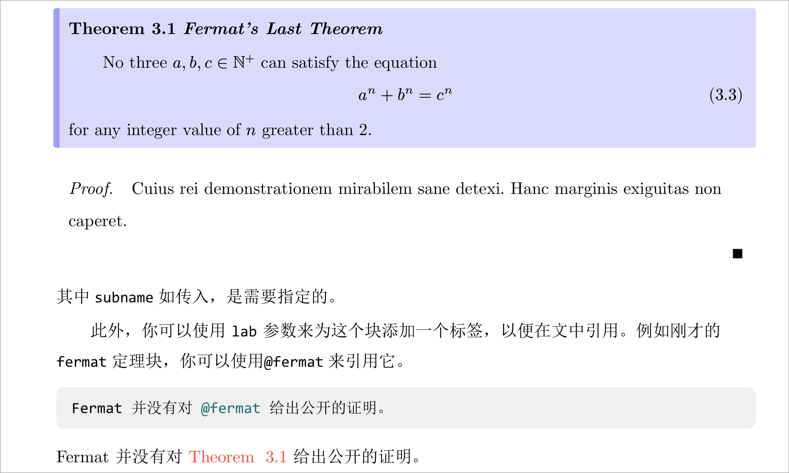

<h1 align="center">
Scripst
</h1>

**Scripst** 是一个基于 **Typst** 的模板包，提供了一套简约高效的文档模板，适用于日常文档、作业、笔记、论文等场景。

<div align="center">

[](https://github.com/An-314/scripst/releases/tag/v1.1.0)
[](https://github.com/An-314/scripst/blob/main/LICENSE)
[](https://an-314.github.io/scripst/zh)
[](https://github.com/An-314/scripst/releases/latest)

简体中文 | [English](https://github.com/An-314/scripst/blob/main/README.md)

</div>

## 📑 目录

- [📑 目录](#-目录)
- [🚀 特性](#-特性)
- [📦 安装](#-安装)
  - [安装 Typst](#安装-typst)
  - [下载 Scripst 模板](#下载-scripst-模板)
    - [方法 1：手动下载](#方法-1手动下载)
    - [方法 2：使用 Typst 本地包管理](#方法-2使用-typst-本地包管理)
- [📄 使用 Scripst](#-使用-scripst)
  - [引入 Scripst 模板](#引入-scripst-模板)
  - [创建 `article` 文档](#创建-article-文档)
- [🔧 模板参数](#-模板参数)
- [🆕 `countblock`模块](#-countblock模块)
  - [创建并注册 `countblock`](#创建并注册-countblock)
  - [使用 `countblock`](#使用-countblock)
  - [封装 `countblock` 模块](#封装-countblock-模块)
- [✨ 模板效果示例与说明](#-模板效果示例与说明)
  - [article 文档](#article-文档)
  - [book 文档](#book-文档)
  - [report 文档](#report-文档)
- [📜 贡献](#-贡献)
- [📌 字体](#-字体)
- [🔗 依赖](#-依赖)
- [📝 许可证协议](#-许可证协议)
- [🎯 TODO](#-todo)
---

## 🚀 特性

- 高扩展性：模块化设计，便于对模板进行扩展
- 多语言设计：针对不同语言进行本地化设计
- 新增模块`countblock`：这是一个可以自定义名称和颜色的模块，内置一个计数器，并且可以在文中随时引用；可以用来做定理、问题、注记等模块，更详细的内容见[🆕 `countblock`模块](#-countblock模块)

<p align="center">
  
  
  
</p>

## 📦 安装

### 安装 Typst

确保已安装 Typst，可以使用以下命令进行安装：

```bash
sudo apt install typst # Debian/Ubuntu
sudo pacman -S typst # Arch Linux
winget install --id Typst.Typst # Windows
brew install typst # macOS
```

或参考 [Typst 官方文档](https://github.com/typst/typst) 了解更多信息。

### 下载 Scripst 模板

如果希望在本地使用，或者需要对模板进行调整，可以手动下载 Scripst 模板。

#### 方法 1：手动下载

1. 访问 [Scripst GitHub 仓库](https://github.com/An-314/scripst)
2. 点击 `<> Code` 按钮
3. 选择 `Download ZIP`
4. 解压后，将模板文件放入你的项目目录

**目录结构建议**
```plaintext
project/
├── src/
│   ├── main.typ
│   ├── components.typ
├── pic/
│   ├── image.jpg
├── main.typ
├── chap1.typ
├── chap2.typ
```
若模板存放于 `src/` 目录下，引入方式：

```typst
#import "src/main.typ": *
```

#### 方法 2：使用 Typst 本地包管理

可手动下载 Scripst 并将其存放至：
```
~/.local/share/typst/packages/preview/scripst/1.1.0                 # Linux
%APPDATA%\typst\packages\preview\scripst\1.1.0                      # Windows
~/Library/Application Support/typst/packages/preview/scripst/1.1.0  # macOS
```

或者运行如下命令：

```bash 
cd {data-dir}/typst/packages/preview/scripst
git clone https://github.com/An-314/scripst.git 1.1.0
```

其中`data-dir`为Typst的数据目录，如上述Linux系统中的`~/.local/share/typst`，Windows系统中的`%APPDATA%\typst`，macOS系统中的`~/Library/Application Support/typst`。

然后在 Typst 文件中直接引入：

```typst
#import "@local/scripst:1.1.0": *
```

即可使用 Scripst 模板。

使用 `typst init` 快速创建项目：

```bash
typst init @local/scripst:1.1.0 project_name
```

---

## 📄 使用 Scripst

### 引入 Scripst 模板

在 Typst 文件开头引入模板：

```typst
#import "@local/scripst:1.1.0": *
```

### 创建 `article` 文档

```typst
#show: scripst.with(
  title: [Scripst 的使用方法],
  info: [这是文章的模板],
  author: ("作者1", "作者2", "作者3"),
  time: datetime.today().display(),
  abstract: [摘要内容],
  keywords: ("关键词1", "关键词2", "关键词3"),
  contents: true,
  content-depth: 2,
  matheq-depth: 2,
  lang: "zh",
)
```

---

## 🔧 模板参数

| 参数 | 类型 | 默认值 | 说明 |
| --- | --- | --- | --- |
| `template` | `str` | `"article"` | 选择模板 (`"article"`, `"book"`, `"report"`) |
| `title` | `content`, `str`, `none` | `""` | 文档标题 |
| `info` | `content`, `str`, `none` | `""` | 文档副标题或补充信息 |
| `author` | `content`, `str`, `array` | `()` | 作者列表 |
| `time` | `content`, `str`, `none` | `""` | 文档时间 |
| `abstract` | `content`, `str`, `none` | `none` | 文档摘要 |
| `keywords` | `array` | `()` | 关键词 |
| `preface` | `content`, `str`, `none` | `none` | 前言 |
| `font-size` | `length` | `11pt` | 字体大小 |
| `contents` | `bool` | `false` | 是否生成目录 |
| `content-depth` | `int` | `2` | 目录深度 |
| `matheq-depth` | `int` | `2` | 数学公式编号深度 |
| `lang` | `str` | `"zh"` | 语言 (`"zh"`, `"en"`, `"fr"` 等) |

---

## 🆕 `countblock`模块

`countblock` 是一个可以自定义名称和颜色的模块，内置一个计数器，并且可以在文中随时引用；可以用来做定理、问题、注记等模块。

下图是一个 `countblock` 模块的示例：



### 创建并注册 `countblock`

Scripst 提供了几个默认的 `countblock` 模块，这些模块已经有预设的颜色和名称，并且已经注册了计数器：
```typst
#let cb = (
  "thm": ("Theorem", color.blue),
  "def": ("Definition", color.green),
  "prob": ("Problem", color.purple),
  "prop": ("Proposition", color.purple-grey),
  "ex": ("Example", color.green-blue),
  "note": ("Note", color.grey),
  "cau": ("⚠️", color.red),
)
```
也可以自己定义 `countblock` 模块
```typst
#let cb = add-countblock("test", "This is a test", teal) // 定义一个名称为 "test" 的 countblock
#show: register-countblock.with("test") // 注册该 countblock
```
这样就可以在文中使用 `test` 模块了。

### 使用 `countblock`

在文中使用 `countblock` 模块：
```typst
#countblock(
  name,
  subname,
  count: true,
  cb: cb,
  lab: none,
)[...]
```
参数说明：
| 参数 | 类型 | 默认值 | 说明 |
| --- | --- | --- | --- |
| `name` | `str` | `""` | 模块名称 |
| `subname` | `str` | `""` | 该次生成块的名称 |
| `count` | `bool` | `true` | 是否计数 |
| `cb` | `dict` | `cb` | `countblock` 的字典 |
| `lab` | `str`, `none` | `none` | 标签 |

例如：
```typst
#countblock("thm", subname: [_Fermat's Last Theorem_], lab: "fermat", cb)[

  No three $a, b, c in NN^+$ can satisfy the equation
  $
    a^n + b^n = c^n
  $
  for any integer value of $n$ greater than 2.
]
#proof[Cuius rei demonstrationem mirabilem sane detexi. Hanc marginis exiguitas non caperet.]
Fermat 并没有对 @fermat 给出公开的证明。
```
就可以生成一个定理模块，并且在文中引用该模块。

### 封装 `countblock` 模块

可以将 `countblock` 模块封装成一个函数，以便在文中多次使用：
```typst
#let test = countblock.with("test", cb)
```
这样就可以在文中使用 `test` 函数了：
```typst
#test[...]
```
同时，Scripst 提供的默认 `countblock` 模块已经做过封装，可以直接 `#theorem`, `#definition`, `#problem`, `#proposition`, `#example`, `#note`, `#caution` 使用。

## ✨ 模板效果示例与说明

### article 文档

<p align="center">
  
  
</p>

[Aritcle 示例](./docs/builds/article.pdf)

### book 文档

<p align="center">
  
  
</p>
  
[Book 示例](./docs/builds/book.pdf)

### report 文档

<p align="center">
  
  
</p>

[Report 示例](./docs/builds/report.pdf)

## 📜 贡献

欢迎提交 Issue 或 Pull Request！如果有改进建议，欢迎加入讨论。

- **GitHub 仓库**：[Scripst](https://github.com/An-314/scripst)
- **问题反馈**：提交 Issue 进行讨论

## 📌 字体

本项目默认使用以下字体：

- 主要字体：[CMU Serif](https://en.wikipedia.org/wiki/Computer_Modern), [Consolas](https://en.wikipedia.org/wiki/Consolas)
- 备选字体：[Linux Libertine](https://en.wikipedia.org/wiki/Linux_Libertine)
- 以及SimSun, SimHei, KaiTi等中文字体

使用默认字体前，请确保已安装该字体，或根据需要在`./src/configs.typ`中进行替换。

## 🔗 依赖

对于部分内容，Scripst 引用了以下 Typst 包：

- [tablem](https://typst.app/universe/package/tablem)
- [physica](https://typst.app/universe/package/physica)

## 📝 许可证协议

本项目使用 MIT 许可证协议。

## 🎯 TODO

- [ ] 加入 `beamer` 模板
- [ ] 加入更多可配置项